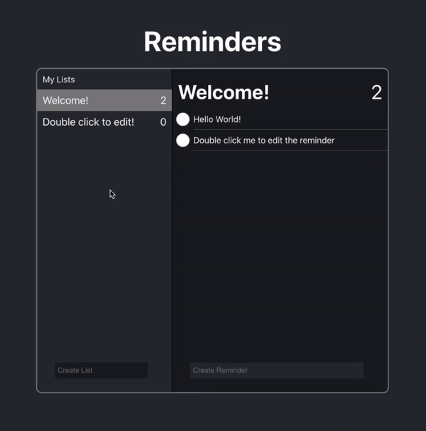

# My Reminders Web App

A simple reminders app, built using TypeScipt, React and React-Redux. Reminders are saved to Local Storage.

  

Hosted at [Netlify](https://reminders-app.netlify.app/).

## Instructions

1. Clone the repo or download all the files
2. Install all the dependencies with `yarn install`
3. Start the development server with `yarn start`

## Authors

- Ivan Cheng
